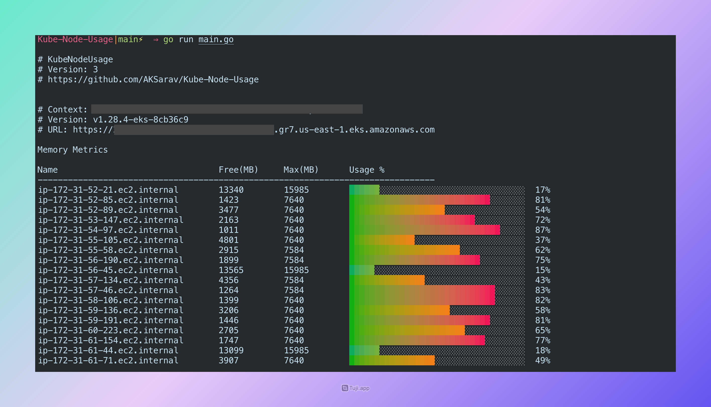
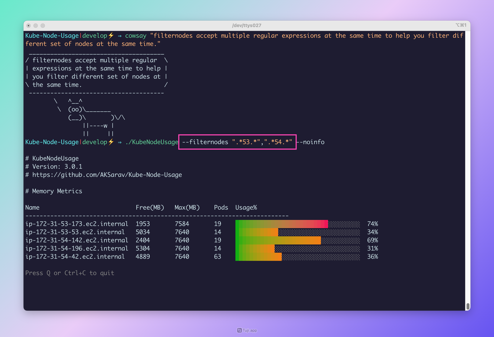

# KubeNodeUsage


**KubeNodeUsage** is a Terminal App designed to provide insights into Kubernetes node usage. It offers various options for customization to help you analyze and filter node metrics effectively.


KubeNodeUsage use your local KubeConfig file to connect to the cluster and use Kubernetes API directly using Kubernetes GO SDK

It fetches the Node Metrics from Kubernetes API and apply filters and aggreations to display it in a nice human readable Graphical format as Bar Charts.

KubeNodeUsage helps you to monitor the **CPU**, **Memory** and **Disk** usage of the Nodes in your Kubernetes Cluster

The output can be sorted, filtered, and customized based on your requirements

KubeNodeUsage has different filters to filter the output based on 

&nbsp;

* NodeName
* Usage 
* Free/Availability of Disk,CPU, Memory
* Max/Capacity of Disk,CPU,Memory
* Color - We use Green, Red and Orange to represent the usage 
  * Green - Below 30% Usage 
  * Orange - Between 30% to 70% Usage
  * Red - Above 70% Usage
* Label - Key Value pair to filter the nodes based on the Label presence on the Node 

&nbsp;

All the filtering is controlled by three main flags
- `filternodes` - This is used to filter the nodes based on the Node Name using Regular Expression
- `filtercolor` - This is used to filter the nodes based on the Color Category ( Green, Orange, Red)
- `filterlabel` - This is used to filter the nodes based on the Label Key Value pair 

&nbsp;

You can sort the output using following flags
- `sortby` - This is used to sort the output based on the specific metric ( name, free, usage, color, capacity, max)
- `desc` - This is used to sort the output in descending order

&nbsp;

**Additional Key Features include**
* Ability to display the Label information as a new column in the output 
* Displaying the Total Pods count in the Cluster 
* To Turn off the Cluster Info display 
* Label - You can display the Label information as a new column in the output  


> Refer the Options and Screenshots section for more details

&nbsp;
## Screenshots :camera:

:sparkle: Screenshot of Latest Version 3.0.1 with Cluster Info 



:sparkle: Screenshot of Version 3.0.2 with Label Column and Total Pods Count with `-noinfo` flag ( to turn off Cluster Info) 


:sparkle: Screenshot of Multiple RegEx patterns with FilterNodes



&nbsp;

:sparkle: Screenshot of Label Filtering with FilterLabel


## Kubernetes Supported Versions / Clusters :white_check_mark:

As KubeNodeUsage use the Kubernetes Go SDK and directly connects to the API - It supports all the Kubernetes cluster which supports `.kube/config` file based authentication 

**Clusters**

I have tested it with the following K8s clusters

* EKS - Elastic Kubernetes Service from AWS
* Azure Kubernetes Service
* GKE - Google Kubernetes Engine
* Minikube
* Kind Cluster

**Versions**

I have tested KubeNodeUsage starting from **1.19 - 1.29** ( the latest stable version as of 30th June)

&nbsp; 

## How it Works :bulb:

KubeNodeUsage is written in `GoLang` and uses `client-go` and `kubernetes` SDK libraries

When you start KubeNodeUsage - It try to read the `$HOME/.kube/config` file in your HOME directory

KubeNodeUsage connects to the Default cluster set by the `CurrentContext` on the ./kube/config file

You can manually edit this file and update it but the recommended way to update current-context is to use `kubectl config use-context`

KubeNodeUsage does not use `kubectl` directly and it relies on the `.kube/config` file and the authentication method defined in there

KubeNodeUsage works the same way - kubectl works based on the configuration information found on .kube/config file

If the `kubectl`commands are not working - its highly likely KubeNodeUsage would fail too - In this case you have to check your Kube config file

&nbsp; 

#### Is it secure ? How about Data Privacy :lock:
KubeNodeUsage do not collect any data or send anywhere 

KubeNodeUsage Source code is Public, Feel free to download and validate it yourself
&nbsp;

## How to Download :arrow_double_down:

You can clone this project and run it as shown below

```
git clone https://github.com/AKSarav/Kube-Node-Usage.git
cd Kube-Node-Usage
go run main.go
```

Or Download the Binaries from the Github release page

Goto the https://github.com/AKSarav/Kube-Node-Usage/releases and download the suitable binary for your OS and use it

```
unzip KubeNodeUsage-windows-386.exe.zip
./KubeNodeUsage-windows-386
```

&nbsp;

## How to use :book:

KubeNodeUsage is a command line utility with lot of startup options/flags 


```bash
KubeNodeUsage [options]
```

You can find the detail information on all available options here

&nbsp;
**Available Options** :memo:

- `help`: Display help information.

- `noinfo` : Disable the Cluster Info display. ( New feature in V3.0.2)

- `metrics`: Choose which metric to display. Valid options include:

    - memory
    - disk
    - cpu

- `filternodes`: Filter nodes based on node name using a regular expression. (Note: Only one filter can be used at a time, and the input should be enclosed in quotes.)

- `filtercolor`: Filter nodes based on color categories. Valid options include:

    - `red` 
    - `green`
    - `orange`

- `filterlabel`: Filter nodes based on the label key-value pair. ( New feature in V3.0.2) Syntax is `--filterlabel=<label-key>=<label-value>`


- `debug`: Enable debug mode. ( Prints more logging for debug)


- `sortby`: Sort the output by a specific metric. Valid options include:

    - `name` (Sort by node name alphabetically)
    - `node` (Sort by node name alphabetically, same as 'name')

    - `free` (Sort by available resources)

    - `usage` (Sort by resource usage)
    - `color` (Sort by color category, same as usage)

    - `capacity` (Sort by resource capacity)
    - `max` (Sort by maximum resource value, same as 'capacity')
-  `desc`: Enable reverse sort order.
-  `label`: Display the Label information as a new column in the output. ( New feature in V3.0.2) Syntax is `--label=<label-key>#<columnname>`
  

&nbsp;
## Examples:

```bash
# Display help information
KubeNodeUsage --help

# Display node usage with default settings (memory is the default metric)
KubeNodeUsage

# To disable the Cluster Info display use --noinfo flag with any other options
KubeNodeUsage --noinfo
KubeNodeUsage --noinfo --metrics cpu
KubeNodeUsage --noinfo --metrics cpu --sortby usage --desc

# Display node usage sorted by node name
KubeNodeUsage --sortby name

# Display node usage sorted by free resources in descending order
KubeNodeUsage --sortby free --desc

# Display node usage sorted by usage in ascending order
KubeNodeUsage --sortby usage

# Display node usage sorted by capacity in descending order
KubeNodeUsage --sortby capacity --desc

# Filter nodes with a name starting with "web" - supports regular expression
KubeNodeUsage --filternodes "web.*"

# Filter nodes with color category "green"
KubeNodeUsage --filtercolor green

# Display memory usage for all nodes
KubeNodeUsage --metrics memory

# Display disk usage for nodes with a name containing "data"
KubeNodeUsage --metrics disk --filternodes ".*data.*"

# Show CPU usage for nodes with color category "red" in descending order
KubeNodeUsage --metrics cpu --filtercolor red --desc

# Display node usage sorted by maximum resource value in ascending order
KubeNodeUsage --sortby max

# Display node usage sorted by capacity, show memory usage, and filter nodes with a name starting with "prod"
KubeNodeUsage --sortby capacity --metrics memory --filternodes "prod.*"

# Show CPU usage for nodes with a name containing "IP range" - here we are using multiple regex patterns as comma separated values
KubeNodeUsage --metrics cpu --filternodes ".*172-31.*",".*172-32.*"

# Display node usage sorted by name, filter nodes with a name starting with "app", and enable debug mode
KubeNodeUsage --sortby name --filternodes "app.*" --debug

# Display Label as a new column in the output. use the `--label` the syntax is "--label=<label-name>:<alias/columnname>" ( New feature in V3.0.2)
KubeNodeUsage --label eks.amazonaws.com/capacityType#capacity 
KubeNodeUsage --label beta.kubernetes.io/instance-type#InstanceType 

# Filter Nodes based on Label Key Value pair ( New feature in V3.0.2)
KubeNodeUsage --filterlabel eks.amazonaws.com/capacityType=OnDemand
KubeNodeUsage --filterlabel beta.kubernetes.io/instance-type=t3.medium
KubeNodeUsage --filterlabel topology.kubernetes.io/zone=us-east-1a


```
&nbsp;
## Todo

* Pod Usage stats to be added as a feature
* Requested vs Limits metrics to be added

&nbsp;

### Contributions / Feature Requests are welcome :handshake:

Feel free to send your Pull requests and Issues to make this better.

&nbsp;

>Please share and Leave a **Github Star** :star: :star: :star: :star:  if you like KubeNodeUsage - It would motivate me
