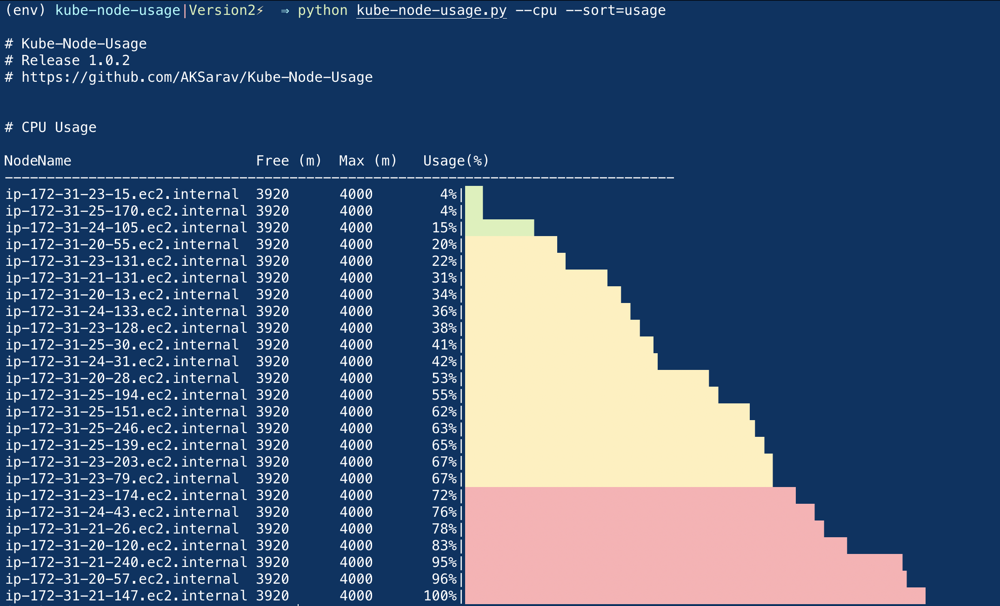
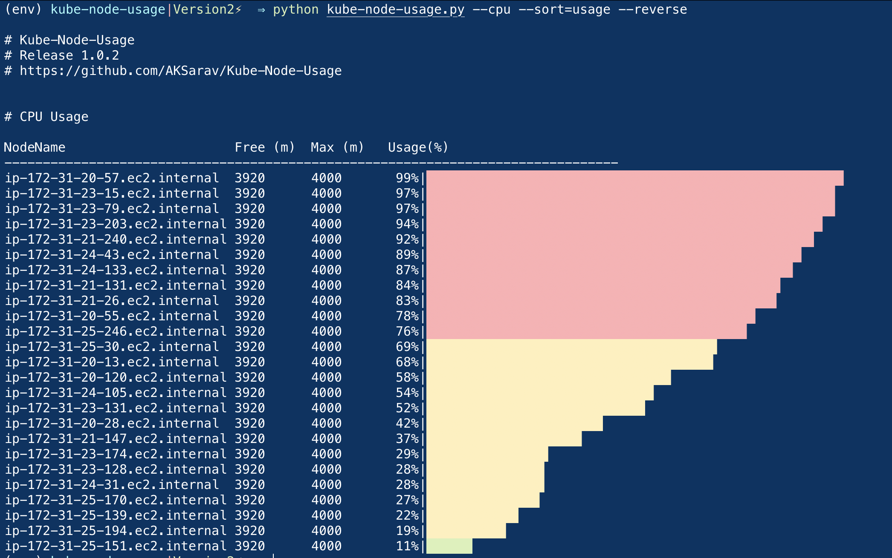
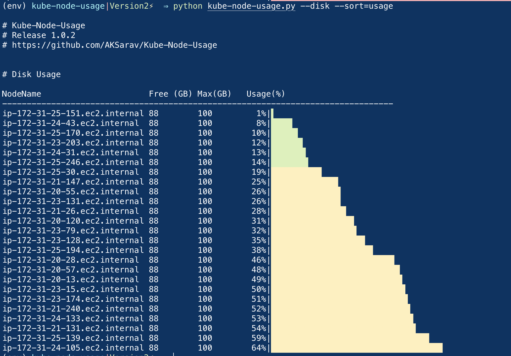
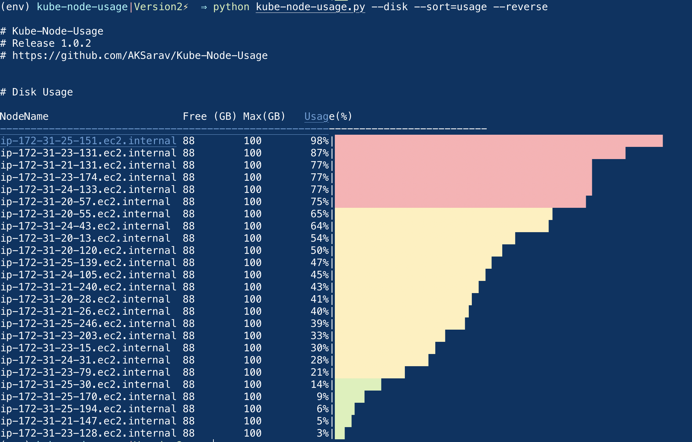
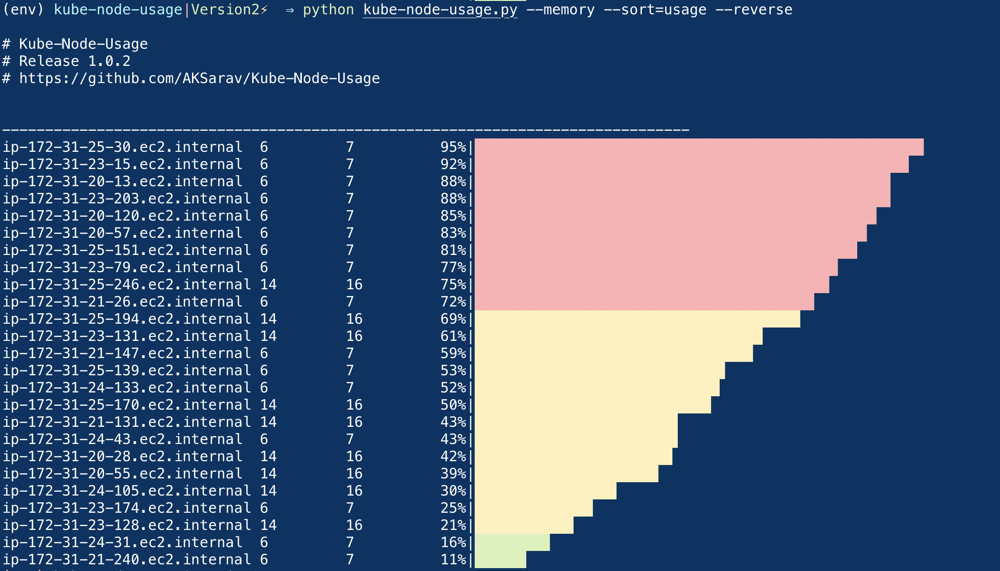
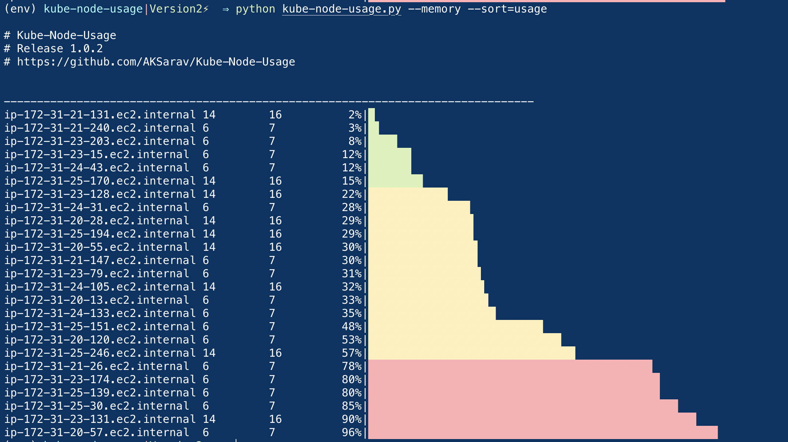
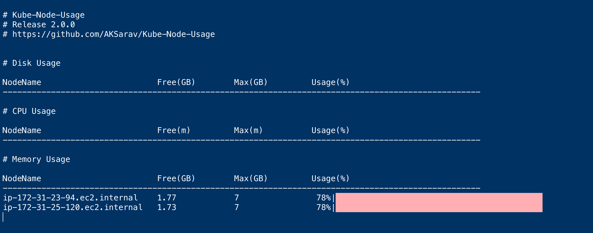
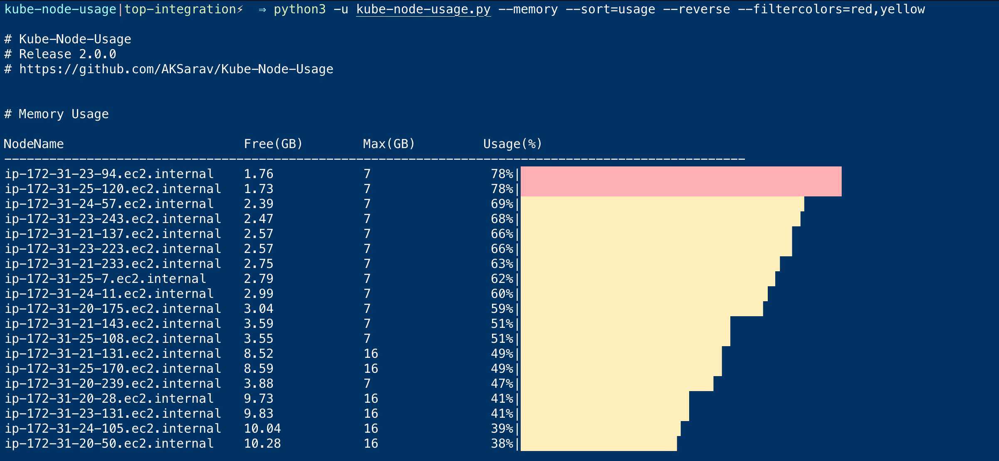

# Kube Node Usage


**Kubernetes Node Usage** or **Kube-Node-Usage** is a CLI tool to get the Memory, CPU and Disk Usage of Kubernetes Nodes

it is designed on python and relies on the `kubectl` installed in your local.

No Authentication data are directly handled.

You can think of `Kube-Node-Usage`  as a wrapper over `kubectl get nodes` and `kubectl top nodes` command

Kube-Node-Usage simply execute the `kubectl get nodes` and `kubectl top nodes` command and parse the output and present it to you with a nice formatting and Usage Bar with more filtering capabilities

&nbsp;

### Prerequisites

1) `Kubectl` must be installed and configured 
2) `Python3` must be installed and used to run the kube-node-usage
3) `pip` package manager is required to install the necassary python packages
4) Must have required Kubernetes Cluster accessr. As we have mentioned. kube-node-usage simply run the `kubectl get nodes` command and parse the output and present it to you.
   
&nbsp;
### Release Notes of V2.0.0

> We have changed the way we calculate the CPU and Memory Usage.

Earlier we were using `kubectl get nodes` command to get the CPU and Memory Usage. But we noticed that the CPU and Memory Usage values are not accurate.

Now we are using `kubectl top nodes` command to get the CPU and Memory Usage.

> With this release we have added the following features


1. Added the `--filternodes` option to filter the nodes based on the node name
2. Added the `--filtercolors` option to filter the nodes based on the color of the usage bar
3. Added the `--interval` option to set the interval between the refresh of the output
4. Added a `--debug` option to print the debug messages
5. Added clear screen before the output is printed

&nbsp;
### Existing Features ( continued from V1)

1. List the Kubernetes Nodes with CPU `--cpu`, Memory `--memory`  and Disk `--memory` Usage
2. with `--all` option you can list the nodes with all the above mentioned usage
3. with `--sort` option you can sort the output based on the `node`, `max`, `free` and `usage` fields
4. you can use `--reverse` option to sort the output in `descending` order

&nbsp;
## List of Possible commands and options

```
usage: kube-node-usage.py [-h] [--cpu] [--memory] [--disk] [--all] [--sort SORT]
                          [--reverse] [--filternodes SINGLE_NODE_NAME OR COMMA SEPARATED_NODE_NAMES]
                          [--filtercolors SINGLE_COLOR OR COMMA SEPARATED_COLORS ] 
                          [--interval SECONDS]
                          [--debug]
```
### How to Set up / Install Kube-Node-Usage

1. Clone the repository

```
git clone https://github.com/AKSarav/Kube-Node-Usage.git
```

2. Install the necassary packages with the following PIP command.

We presume you have pip and python3 installed


```
pip install -r requirements.txt
```

3. Execute the command to list the kubernetes nodes with their Usage Information

<br/>
<br/>

For some reason, If you do not wish to install the required python packages into the entire system

You can create your virtual environment (virtualenv) and install the packages

Here are the commands for the same

```
# python -m venv venv
# source venv/bin/activate
# pip install -r requirements.txt
```
Once you have used the `kube-node-usage` you can execute the `deactivate` command

```
# deactivate
```

### How to use Kube-Node-Usage

Here are the list of commands Kube-Node-Usage supports and how it can be used.


```
python3 kube-node-usage.py --memory --sort=name
python3 kube-node-usage.py --memory --sort=node
python3 kube-node-usage.py --memory --sort=free
python3 kube-node-usage.py --memory --sort=max
python3 kube-node-usage.py --memory --sort=usage
python3 kube-node-usage.py --memory --sort=usage --reverse
python3 kube-node-usage.py --memory --sort=usage --reverse --filtercolors=red
python3 kube-node-usage.py --memory --sort=usage --reverse --filtercolors=red,yellow
python3 kube-node-usage.py --memory --sort=usage --reverse --filtercolors=red,green
python3 kube-node-usage.py --memory --sort=usage --reverse --filtercolors=red --interval=10
python3 kube-node-usage.py --memory --sort=usage --reverse --filternodes=ip-172-31-23-94.ec2.internal
python3 kube-node-usage.py --memory --sort=usage --reverse --filternodes=ip-172-31-23-94.ec2.internal,ip-172-31-25-7.ec2.internal
python3 kube-node-usage.py --memory --sort=usage --reverse --filternodes=ip-172-31-23-94.ec2.internal,ip-172-31-25-7.ec2.internal --interval=10


python3 kube-node-usage.py --cpu --sort=name
python3 kube-node-usage.py --cpu --sort=node
python3 kube-node-usage.py --cpu --sort=free
python3 kube-node-usage.py --cpu --sort=max
python3 kube-node-usage.py --cpu --sort=usage
python3 kube-node-usage.py --cpu --sort=usage --reverse
python3 kube-node-usage.py --cpu --sort=usage --reverse --filtercolors=red
python3 kube-node-usage.py --cpu --sort=usage --reverse --filtercolors=red,yellow
python3 kube-node-usage.py --cpu --sort=usage --reverse --filtercolors=red,green
python3 kube-node-usage.py --cpu --sort=usage --reverse --filtercolors=red --interval=10
python3 kube-node-usage.py --cpu --sort=usage --reverse --filternodes=ip-172-31-23-94.ec2.internal
python3 kube-node-usage.py --cpu --sort=usage --reverse --filternodes=ip-172-31-23-94.ec2.internal,ip-172-31-25-7.ec2.internal
python3 kube-node-usage.py --cpu --sort=usage --reverse --filternodes=ip-172-31-23-94.ec2.internal,ip-172-31-25-7.ec2.internal --interval=10


python3 kube-node-usage.py --disk --sort=name
python3 kube-node-usage.py --disk --sort=node
python3 kube-node-usage.py --disk --sort=free
python3 kube-node-usage.py --disk --sort=max
python3 kube-node-usage.py --disk --sort=usage
python3 kube-node-usage.py --disk --sort=usage --reverse
python3 kube-node-usage.py --disk --sort=usage --reverse --filtercolors=red
python3 kube-node-usage.py --disk --sort=usage --reverse --filtercolors=red,yellow
python3 kube-node-usage.py --disk --sort=usage --reverse --filtercolors=red,green
python3 kube-node-usage.py --disk --sort=usage --reverse --filtercolors=red --interval=10
python3 kube-node-usage.py --disk --sort=usage --reverse --filternodes=ip-172-31-23-94.ec2.internal
python3 kube-node-usage.py --disk --sort=usage --reverse --filternodes=ip-172-31-23-94.ec2.internal,ip-172-31-25-7.ec2.internal
python3 kube-node-usage.py --disk --sort=usage --reverse --filternodes=ip-172-31-23-94.ec2.internal,ip-172-31-25-7.ec2.internal --interval=10


python3 kube-node-usage.py --all --sort=name
python3 kube-node-usage.py --all --sort=node
python3 kube-node-usage.py --all --sort=free
python3 kube-node-usage.py --all --sort=max
python3 kube-node-usage.py --all --sort=usage
python3 kube-node-usage.py --all --sort=usage --reverse
python3 kube-node-usage.py --all --sort=usage --reverse --filtercolors=red
python3 kube-node-usage.py --all --sort=usage --reverse --filtercolors=red,yellow
python3 kube-node-usage.py --all --sort=usage --reverse --filtercolors=red,green
python3 kube-node-usage.py --all --sort=usage --reverse --filtercolors=red --interval=10
python3 kube-node-usage.py --all --sort=usage --reverse --filternodes=ip-172-31-23-94.ec2.internal
python3 kube-node-usage.py --all --sort=usage --reverse --filternodes=ip-172-31-23-94.ec2.internal,ip-172-31-25-7.ec2.internal
python3 kube-node-usage.py --all --sort=usage --reverse --filternodes=ip-172-31-23-94.ec2.internal,ip-172-31-25-7.ec2.internal --interval=10


```

### Screenshots 


&nbsp;

&nbsp;

&nbsp;

&nbsp;

&nbsp;

&nbsp;

&nbsp;

&nbsp;

&nbsp;


### Pull requests and Issues are welcome

Feel free to send your Pull requests to make this tool better.

If you happen to see any issues. please create an issue and I will have it checked.


</br>

### If you like this tool. please let me know by clicking on the Github Stars 


### How to reach me

Linked in : https://www.linkedin.com/in/saravakdevopsjunction/
Website: https://devopsjunction.com, https://middlewareinventory.com


