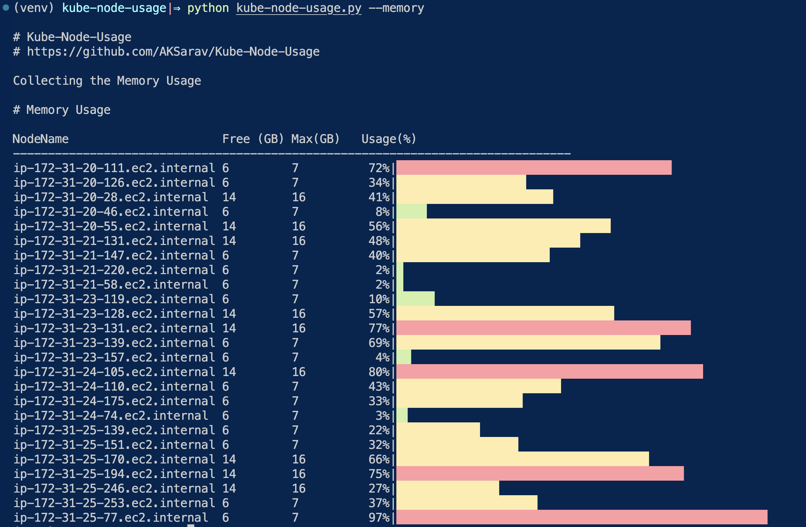
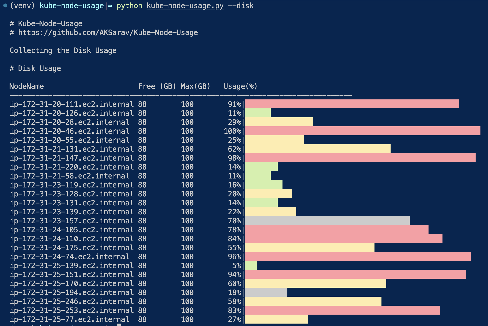

# Kube-node-usage


**Kubernetes Node Usage** or **Kube-Node-Usage** is a CLI tool to get the Memory, CPU and Disk Usage of Kubernetes Nodes

it is designed on python and relies on the `kubectl` installed in your local.

No Authentication data are directly handled.

You can think of `Kube-Node-Usage`  as a wrapper over `kubectl get nodes` command

Kube-Node-Usage simply execute the `kubectl get nodes` command and parse the output and present it to you with a nice formatting and Usage Bar


### Prerequisites

1) `Kubectl` must be installed and configured 
2) `Python3` must be installed and used to run the kube-node-usage
3) `pip` package manager is required to install the necassary python packages
4) Must have required Kubernetes Cluster accessr. As we have mentioned. kube-node-usage simply run the `kubectl get nodes` command and parse the output and present it to you.
   


<br/>

### How to Set up / Install Kube-Node-Usage

1. Clone the repository

```
git clone https://github.com/AKSarav/Kube-Node-Usage.git
```

2. Install the necassary packages with the following PIP command.

We presume you have pip and python3 installed


```
pip install -r requirements.txt
```

3. Execute the command to list the kubernetes nodes with their Usage Information

<br/>
<br/>

For some reason, If you do not wish to install the required python packages into the entire system

You can create your virtual environment (virtualenv) and install the packages

Here are the commands for the same

```
# python -m venv venv
# source venv/bin/activate
# pip install -r requirements.txt
```
Once you have used the `kube-node-usage` you can execute the `deactivate` command

```
# deactivate
```

### How to use Kube-Node-Usage

Here are the list of commands Kube-Node-Usage supports and how it can be used.

<br/>
##### List the Node with Disk Usage

To list the Kubernetes nodes with Disk Usage execute the following command

```
## To List Nodes with Disk Usage

# python kube-node-usage.py -d
(or)
# python kube-node-usage.py --disk
```

<br/>

##### List the Node with CPU Usage

To list the Kubernetes nodes with CPU Usage execute the following command

```
## To List Nodes with CPU Usage

# python kube-node-usage.py -c
(or)
# python kube-node-usage.py --cpu
```

<br/>

##### List the Node with Memory Usage

To list the Kubernetes nodes with Memory Usage execute the following command

```
## To List Nodes with Memory Usage

# python kube-node-usage.py -m
(or)
# python kube-node-usage.py --memory

```

##### List the Node with All - CPU, MEMORY, DISK Usage

To list the Kubernetes nodes with Memory Usage execute the following command

```
## To List Nodes with All the CPU, Memory, Disk Usage

# python kube-node-usage.py -a
(or)
# python kube-node-usage.py --all

```

### Screenshots 


> **Note**  
> All the data shown here are created with Random Usage data. The Free, Max and the Usage% may not add up


**Kubernetes Nodes CPU Usage**


**Kubernetes Nodes Memory Usage**


**Kubernetes Nodes Disk Usage**



### Pull requests and Issues are welcome

Feel free to send your Pull requests to make this tool better.

If you happen to see any issues. please create an issue and I will have it checked.


### If you like this tool. please let me know by clicking on the Github Stars 


### How to reach me

Linked in : https://www.linkedin.com/in/saravakdevopsjunction/
Website: https://devopsjunction.com


